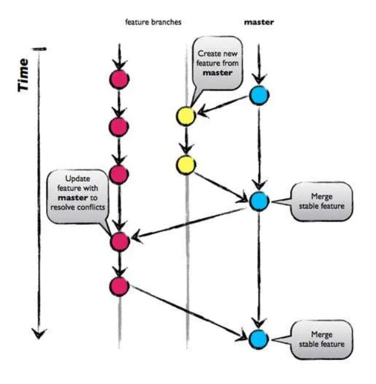
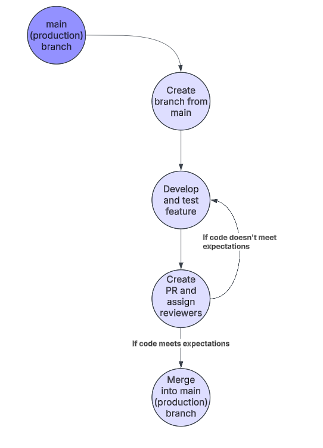

## Development workflow
Suggested workflow to ensure code quality, consistency, and streamlined collaboration across the team:
1. Production Branch: The primary production branch is master/main.
2. Feature Branch Creation: Developers must pull main branch and create a feature branch from master/main before starting any work.
3. Development & Testing: Developers work on their feature branch and complete necessary testing before proceeding.
4. Pull Request Submission: Once development and testing are finished, the developer creates a Pull Request (PR) and assigns reviewers.
5. Code Review & Approval:
    - Reviewers assess the PR, ensuring code quality, logic correctness, and adherence to standards.
    - If issues are found, reviewers request changes, and the developer must address them.
6. If the code meets expectations, reviewers approve the PR.
7. Merging to Production: Once approved, the PR is merged into master/main, following any required deployment or release processes.

Visually this branching strategy (GitHub Flow) looks like this:

Development process diagram:

